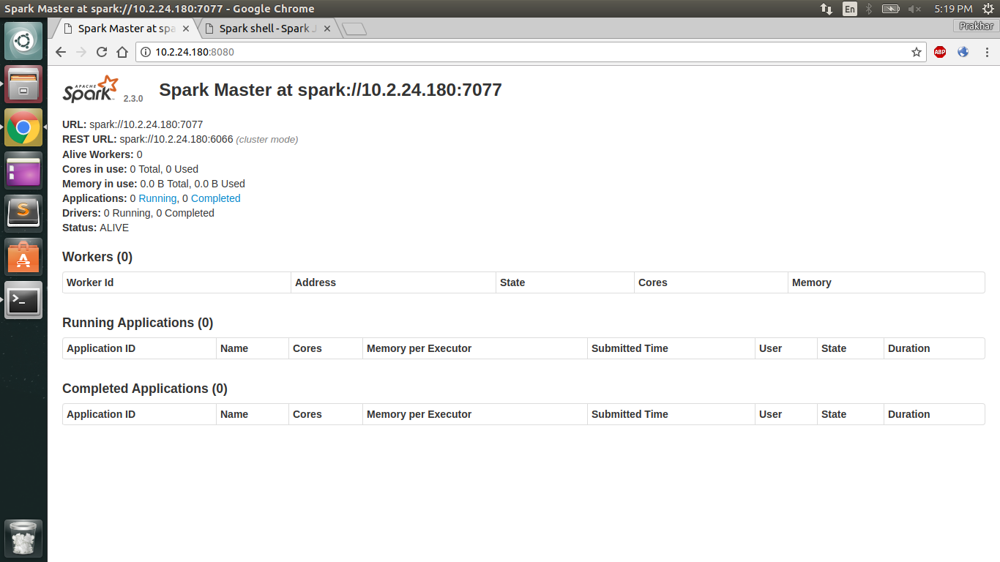
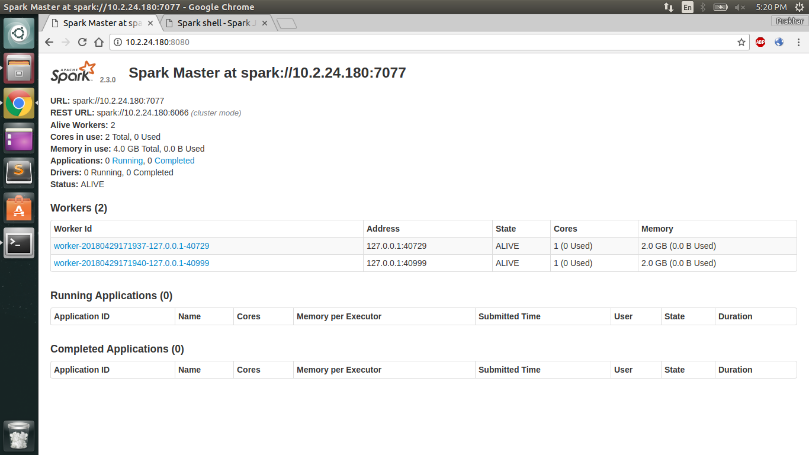
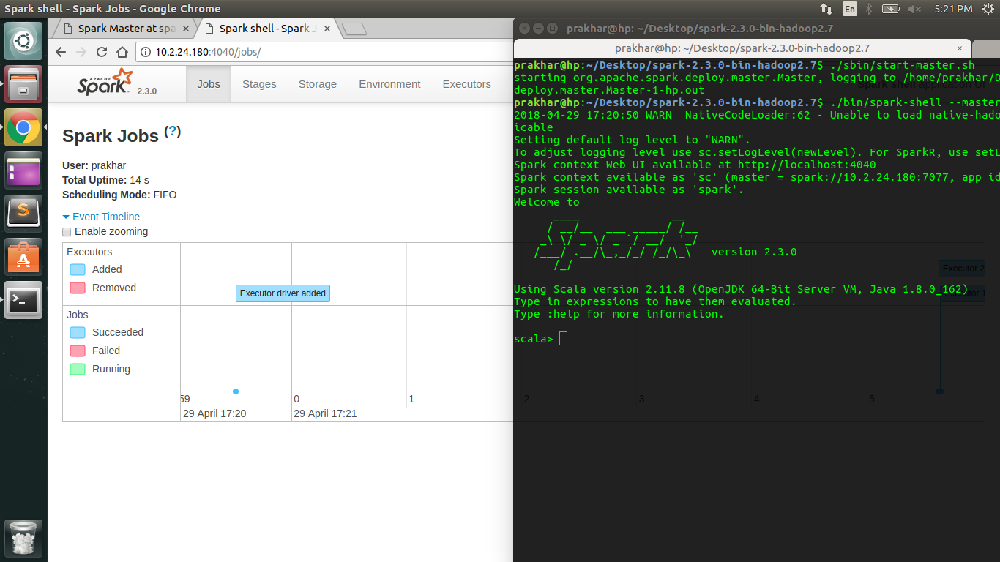
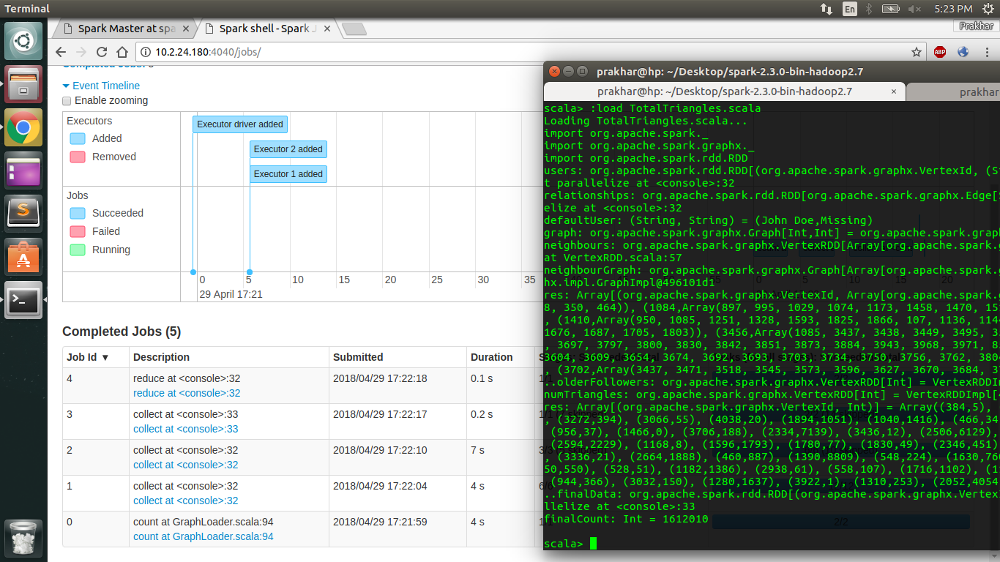
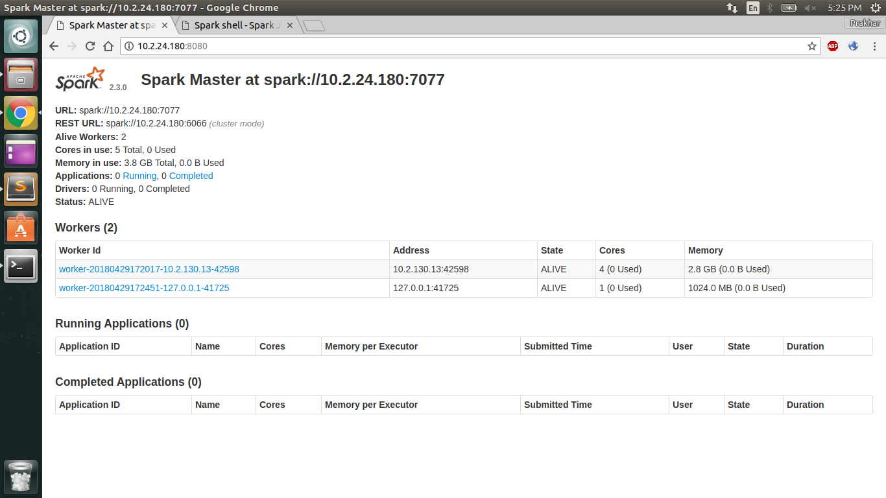
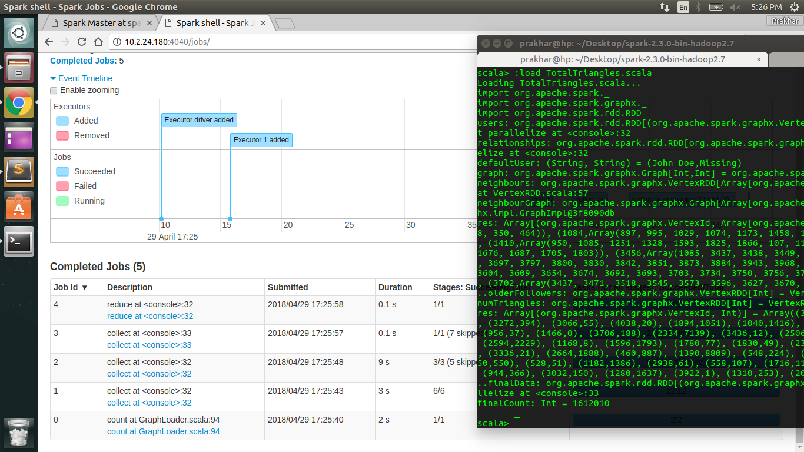

# Distributed Program for Triangle Counting (Using Apache Spark's GraphX)

#### We wrote our own Triangle counting program that runs on Graphx.

#### Set up a small cluster and done some simulations.

#### With 1 remote slave with 4 cores and 2 local slaves.

#### The results of simulations are in the screenshots.
#### The scala file has the program.

